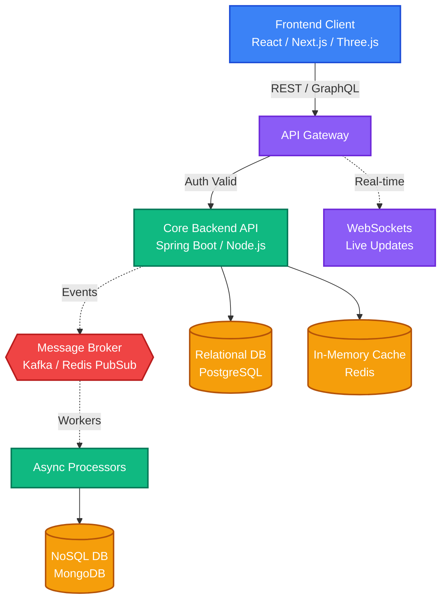

  <!-- 4K High-Quality 3D Render Banner -->
  

  

  
  
  
  

  

  <h2>🚀 Full Stack Visionary</h2>
  

    I engineer <b>dynamic, modern, and highly interactive applications</b> from the ground up. 
    As a <b>Full Stack Developer</b>, I specialize in combining <b>stunning 3D UIs, 4K visual quality</b>, and smooth animations  
    with <b>robust, scalable, event-driven backend systems</b>. 
  

### 🎮 Interactive Tech Stack (Click to Expand)

  
<b>✨ Frontend, 3D & UI/UX</b>

   
  

    
  

  
<i>Building immersive interfaces with React, Next.js, and modern web rendering.</i>

  
<b>⚙️ Backend & Architecture</b>

   
  

    
  

  
<i>Architecting scalable APIs, event-driven services, and rapid real-time systems.</i>

  
<b>🗄️ Database, Cloud & Infrastructure</b>

   
  

    
  

  
<i>Deploying robust and containerized infrastructure using Docker, K8s, and leading cloud providers.</i>

  

<h2 align="center">🏆 GitHub Gamification & Stats</h2>

  

 

  
  

 

  
  

  

<h2 align="center">🏗️ Dynamic System Architecture</h2>

<i>A visual representation of an interactive, robust Full-Stack architecture.</i>

 

  
<i>Building the web. Beautifully. Flawlessly.</i>

  

