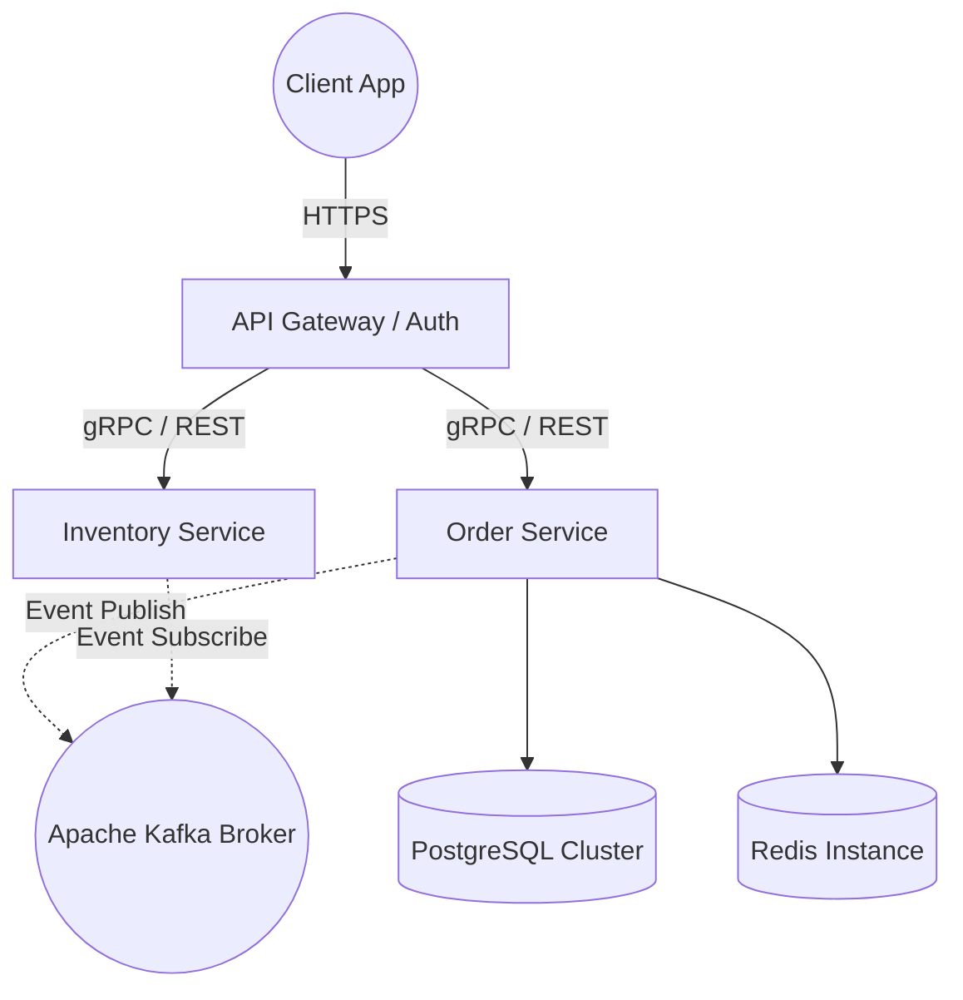

  

  

  
  
  

 

<table align="center" style="border: none;">
  <tr>
    <td width="45%" align="center">
      
    </td>
    <td width="55%" align="left">
      <h2 style="color: #38B6FF;">🚀 Engineering Philosophy</h2>
      
I specialize in <b>Backend Engineering</b> and <b>System Architecture</b>. I don't just write code; I design resilient, horizontally scalable data pipelines and APIs that solve complex business problems.

       
      
⚙️ <b>Core Focus:</b> Microservices, Event-Driven Architecture, High-Throughput Distributed Systems, and Database Query Optimization.

      
💡 <b>Mantra:</b> <i>"Build for scale, design for maintenance, code for clarity."</i>

    </td>
  </tr>
</table>

 

<h3 align="center">🛠️ Technology Arsenal</h3>

  
<i>A curated stack optimized for robust, enterprise-grade applications.</i>

   
  

 

<table align="center" width="100%" style="border: none;">
  <tr>
    <td width="50%" align="center">
      <h3>📊 Developer Analytics</h3>
      
    </td>
    <td width="50%" align="center">
      <h3>🏆 Languages Matrix</h3>
      
    </td>
  </tr>
</table>

  <h3>🔥 LeetCode Performance Tracker</h3>
  

 

<h3 style="display: inline-block; cursor: pointer;">🏛️ View Sample Microservice Architecture</h3>

 

 

  
   
  
Visitor count: 

