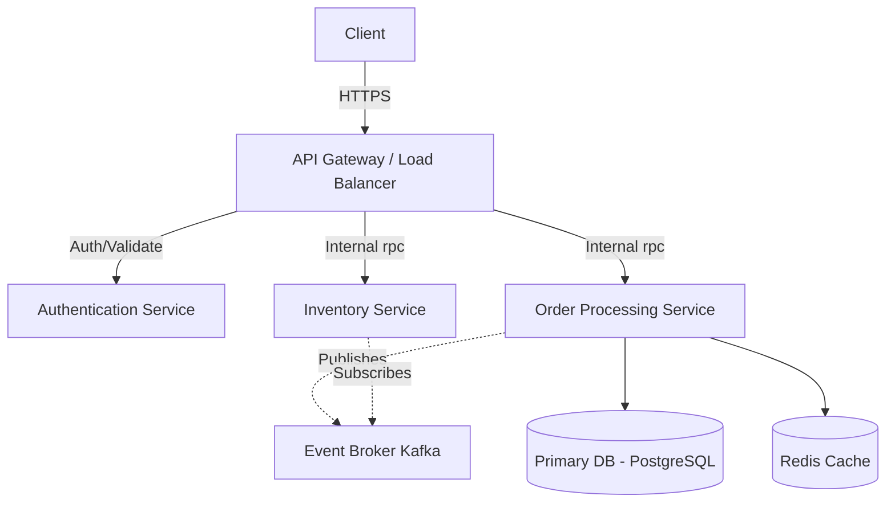

  <h1>Puspharaj</h1>
  <h3>Backend Engineer & System Design Specialist</h3>
  
Building scalable backend systems, high-performance APIs, and distributed architectures.

  
  
  

---

### 💻 Technical Positioning

I am a **Java Full Stack Developer** operating primarily as a **Backend & Distributed Systems Engineer**. My focus is on architecting resilient server-side applications, optimizing database queries for high throughput, and implementing latency-sensitive microservices. I bridge the gap between complex product requirements and scalable, maintainable engineering solutions.

---

### ⚙️ Core Engineering Competencies

| Domain | Focus Areas & Capabilities |
| :--- | :--- |
| **Backend Architecture** | Microservices, RESTful & gRPC APIs, Event-Driven Systems |
| **System Design** | Horizontal Scaling, High Availability, Load Balancing, Caching Strategies |
| **Database Engineering** | ACID Transactions, Query Optimization, Indexing, Data Modeling |
| **Performance & Security** | Throughput Optimization, OAuth2 / JWT Authentication, Rate Limiting |

---

### 🏛 Architecture & System Design Capabilities

I approach software engineering methodically, prioritizing decoupling, fault tolerance, and observability.

<b>Sample System Architecture (Placeholder)</b>

 

*(Note: I regularly update this diagram to reflect the latest architecture I am designing or exploring.)*

---

### 🛠 Tech Radar

I classify technologies based on my production readiness and depth of expertise.

- **Core (Production-Ready):** Java, Spring Boot, Spring Security, MySQL, Hibernate
- **Working (Active Development):** Python, Node.js, JavaScript/TypeScript, React, Redis, Docker
- **Exploring (Experimenting):** Kubernetes, Apache Kafka, Go, GraphQL

---

### ⚡ Engineering Impact

A selection of high-impact systems I have built. Focus is on *scale and performance*.

1. **[E-Commerce Order Processing Engine](#)**
   - **Context:** Built a highly available backend for handling concurrent order transactions.
   - **Architecture:** Spring Boot, PostgreSQL, Redis.
   - **Impact:** Reduced p99 API latency by 40% through aggressive caching and query optimization. 

2. **[Real-Time Notification System](#)**
   - **Context:** Event-driven service for broadcasting user alerts.  
   - **Architecture:** Node.js, WebSockets, RabbitMQ.
   - **Impact:** Scaled to support thousands of concurrent persistent connections with sub-second message delivery.

*(Tip: Pin these repositories to your profile and link them here.)*

---

### � GitHub Activity

  
  

---

### 🧩 Algorithmic Problem Solving

<b>View DSA & Competitive Programming</b>

 

I consistently solve complex algorithmic challenges to maintain sharp problem-solving fundamentals. Strong command over Data Structures, Graph Theory, and Dynamic Programming.

- **LeetCode Profile:** [Puspharaj-7](https://leetcode.com/puspharaj-7)
- **Primary Focus:** Algorithm Optimization, Space-Time Complexity Analysis.

---

### � Current Status

- 🏗 **Currently Building:** A lightweight distributed caching layer for analytical workloads.
- 🤝 **Open to Collaboration:** Backend performance optimization projects, scalable architecture design, and open-source contributions.
- � **Ask me about:** Spring Boot internals, database indexing, and microservice decomposition strategies.

---

  
Visitor count: 

  
<i>Designing systems that scale.</i>

