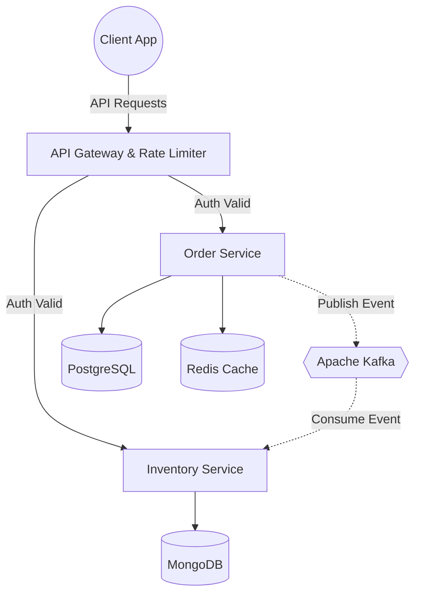

  

  

  
  
  

---

 

<table align="center" width="100%" style="border-collapse: collapse; border: none;">
  <tr style="border: none;">
    <td width="55%" valign="top" style="border: none; padding-right: 20px;">
      <h3 style="margin-top: 0;">📌 Professional Profile</h3>
      
I engineer <b>scalable, high-performance backend systems</b> that drive core business logic. My expertise spans designing event-driven architectures, optimizing relational and NoSQL databases, and ensuring the reliability of large-scale microservices.

      <ul>
        <li><b>Architecture:</b> Microservices, Event-Driven, REST & gRPC APIs</li>
        <li><b>Infrastructure:</b> Containerization, Cloud Deployment, CI/CD pipelines</li>
        <li><b>Performance:</b> Query Optimization, Distributed Caching, Latency Reduction</li>
      </ul>
    </td>
    <td width="45%" valign="top" style="border: none;" align="center">
      <h3 style="margin-top: 0;">⚙️ Core Technologies</h3>
      <a href="https://skillicons.dev">
         
         
        
      </a>
    </td>
  </tr>
</table>

 

---

<h3 align="center">📊 Engineering Analytics</h3>

<table align="center" width="100%" style="border: none;">
  <tr style="border: none;">
    <td align="center" width="50%" style="border: none;">
      <picture>
        <source media="(prefers-color-scheme: dark)" srcset="https://github-readme-stats.vercel.app/api?username=puspharaj-7&show_icons=true&theme=transparent&title_color=58a6ff&text_color=c9d1d9&icon_color=58a6ff&hide_border=true">
        <source media="(prefers-color-scheme: light)" srcset="https://github-readme-stats.vercel.app/api?username=puspharaj-7&show_icons=true&theme=transparent&title_color=0969da&text_color=24292f&icon_color=0969da&hide_border=true">
        
      </picture>
    </td>
    <td align="center" width="50%" style="border: none;">
      <picture>
        <source media="(prefers-color-scheme: dark)" srcset="https://github-readme-stats.vercel.app/api/top-langs/?username=puspharaj-7&layout=compact&theme=transparent&title_color=58a6ff&text_color=c9d1d9&hide_border=true">
        <source media="(prefers-color-scheme: light)" srcset="https://github-readme-stats.vercel.app/api/top-langs/?username=puspharaj-7&layout=compact&theme=transparent&title_color=0969da&text_color=24292f&hide_border=true">
        
      </picture>
    </td>
  </tr>
</table>

  

 

---

<h3 align="center">🏗️ System Architecture Showcase</h3>

<i>A scalable, event-driven microservices pattern for high-throughput processing.</i>

 

---

  
<i>Turning architectural concepts into production-ready reality.</i>

   
  

