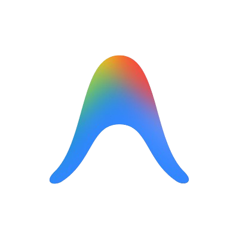

<div align="center">
  
</div>

<br/>

<div align="center">
  
### 👨‍💻 Building Scalable Backend Systems & High-Performance APIs

*"Clean code is not written by following a set of rules. You know you are working on clean code when each routine you read turns out to be pretty much what you expected."*  
— Robert C. Martin

</div>

<br/>

## 🎯 About Me


```yaml
name: Puspharaj
role: Java Full Stack Developer
focus: Backend Engineering & System Design
education: Mechanical Engineering Background
passion: Building Robust, Scalable Solutions

current_focus:
  - Advanced DSA & Problem Solving
  - Distributed Systems Architecture
  - Microservices Design Patterns
  - Spring Boot Ecosystem Mastery

philosophy: |
  "Code is poetry written for machines,
   but read by humans."
```

<br clear="all"/>

## 🛠️ Technology Stack

### Core Technologies

<p align="center">
  
  
  
  
  
</p>

### Frontend & Web Technologies

<p align="center">
  
  
  
  
  
</p>

### Development Tools

<p align="center">
  
  
  
  
  
</p>

<br/>

## 📈 Performance Metrics

<div align="center">

### LeetCode Journey


<br/>

### Contribution Activity


</div>

<br/>

## 🎓 Areas of Expertise

<div align="center">

| 🏗️ **Backend Development** | 🔧 **System Design** | 🧮 **Problem Solving** |
|:---:|:---:|:---:|
| RESTful API Design | Microservices Architecture | Data Structures |
| Database Optimization | Scalability Patterns | Algorithm Design |
| Spring Boot Ecosystem | Distributed Systems | Complexity Analysis |
| Authentication & Security | Caching Strategies | Competitive Programming |

</div>

<br/>

## 🌟 What Drives Me

- 💡 **Innovation**: Continuously exploring cutting-edge technologies and design patterns
- 🎯 **Quality**: Writing clean, maintainable, and well-documented code
- 📚 **Learning**: Committed to continuous improvement and knowledge sharing
- 🤝 **Collaboration**: Building meaningful solutions through teamwork
- 🚀 **Impact**: Creating systems that scale and deliver real value

<br/>

## 📫 Let's Connect

<div align="center">

[](https://github.com/puspharaj-7)
[](https://leetcode.com/puspharaj-7)
[](#)
[](#)

</div>

<br/>

<div align="center">
  
### 💭 Developer Quote
  


</div>

<br/>

---

<div align="center">
  
*"First, solve the problem. Then, write the code."* — John Johnson

<br/>


</div>

