```mermaid
graph TD;
    Client((Client App))-->|HTTPS / TLS| Gateway[API Gateway]
    Gateway-->|Load Balanced| Auth[OAuth2 Security Layer]
    Auth-->|Validated Request| OrderService[🛒 Order Microservice]
    Auth-->|Validated Request| InventoryService[📦 Inventory Microservice]
    
    OrderService-.->|Publishes Event| Kafka((Apache Kafka Event Bus))
    InventoryService-.->|Subscribes| Kafka
    
    OrderService-->DB1[(PostgreSQL Cluster)]
    OrderService-->Cache[(Redis ElastiCache)]
```
  

  

  
  
  

 

<table align="center" style="border: none;">
  <tr>
    <td width="40%" align="center">
      
    </td>
    <td width="60%" align="left">
      <h2>🚀 About My Engineering Trajectory</h2>
      
I operate at the intersection of <b>high-performance backend engineering</b> and <b>distributed system architecture</b>. I specialize in designing fault-tolerant, scalable solutions capable of handling massive throughput.

       
      
✨ <b>Current Focus:</b> Building robust Java/Spring microservices, optimizing database indexing, and event-driven architectures.

      
🯠<b>Objective:</b> Delivering clean, maintainable, and highly efficient backend systems.

    </td>
  </tr>
</table>

 

<h2 align="center">🌐 4K Tech Stack Terminal</h2>

  
<i>Technologies scaled for maximum production efficiency</i>

   
  

 

<h2 align="center">🎛️ Interactive System Architecture</h2>

<b>🔥 Click to Reveal: Microservices Data Flow Architecture</b>

 

<b>📈 Click to Reveal: Dynamic GitHub Analytics</b>

 

  <i>(Tip: Set up <a href="https://github.com/yoshi389111/github-profile-3d-contrib">GitHub Profile 3D Contrib</a> for native 3D graph rendering!)</i>
    
  
  

<b>💻 Click to Reveal: Algorithmic & LeetCode Edge</b>

 

  

 

  

