<!-- ⭐ 4K / 3D Animated Header ⭐ -->

  

 

<!-- ⭐ Interactive Typing Animation ⭐ -->

  

 

<!-- ⭐ Floating Social Badges ⭐ -->

  
  
  

  

<!-- ⭐ 3D Intro Section ⭐ -->
<table align="center" style="border: none; background: transparent;">
  <tr>
    <td width="50%" align="center">
      <!-- High-Quality 3D Server/Cyber GIF -->
      
    </td>
    <td width="50%" align="left">
      <h2 style="color: #00e5ff;">🌌 The Digital Architect</h2>
      
I engineer the invisible engines that power the modern web. From <b>millisecond-latency microservices</b> to <b>petabyte-scale data pipelines</b>, my focus is bridging raw performance with unbreakable reliability.

       
      
🛠️ <b>Current Mission:</b> Advancing my expertise in Event-Driven Architecture, gRPC APIs, and Cloud-Native System Design.

      
🯠<b>Core Philosophy:</b> Code is infrastructure. Make it modular, make it lightning fast, and make it scalable.

    </td>
  </tr>
</table>

  

<!-- ⭐ 4K Tech Stack Interactive Elements ⭐ -->
<h2 align="center">⚙️ Technological Arsenal</h2>

  
<i>Hover across the tech stack powering my architectural innovations</i>

   
  

  

<!-- ⭐ Interactive Architecture ⭐ -->
<h2 align="center">🏗️ 3D Architectural Blueprint</h2>

<h3 style="display: inline-block; cursor: pointer; color: #00e5ff; transition: 0.3s;">Click to Reveal: Real-Time Event-Driven Architecture Overview 👁️</h3>

 

```mermaid
graph TD;
    ClientApp[📱 Web/Mobile Client] -->|HTTPS / TLS 1.3| LoadBalancer{🌐 Layer 7 Load Balancer}
    LoadBalancer --> APIAuth[🔐 API Gateway & Auth]
    
    APIAuth -->|gRPC| UserService[👤 User Service]
    APIAuth -->|gRPC| TransactionService[💸 Transaction Service]
    
    TransactionService -.->|Produce Event| KafkaCluster((⚡ Apache Kafka Broker Cluster))
    
    KafkaCluster -.->|Consume Event| NotificationService[📩 Notification Worker]
    KafkaCluster -.->|Consume Event| AnalyticsService[📊 Analytics Engine]
    
    UserService --> PrimaryDB[(🗄️ Master Node PostgreSQL)]
    TransactionService --> FastCache[(🚀 Redis ElastiCache)]
```

*A resilient, production-grade microservices blueprint designed for high throughput and zero downtime.*

  

<!-- ⭐ Dynamic GitHub Analytics (4K Styling) ⭐ -->
<h2 align="center">� Real-Time Development Analytics</h2>

<h3 style="display: inline-block; cursor: pointer; color: #00e5ff;">Toggle: GitHub & LeetCode Performance Metrics ⚡</h3>

 
<table align="center" width="100%" style="border: none;">
  <tr>
    <td width="50%" align="center">
      
    </td>
    <td width="50%" align="center">
      
    </td>
  </tr>
</table>

  

  

<!-- ⭐ Animated Footer ⭐ -->

  
   
  

